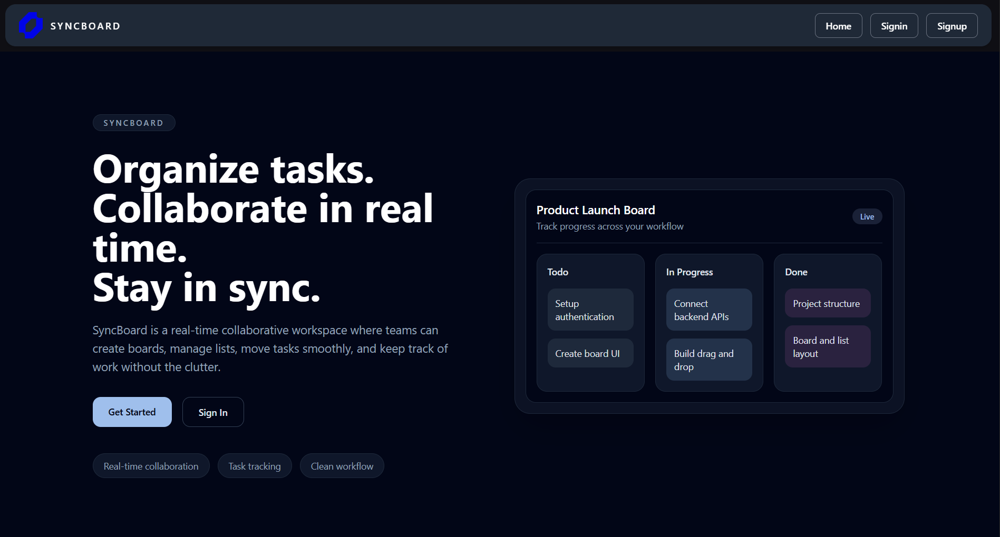
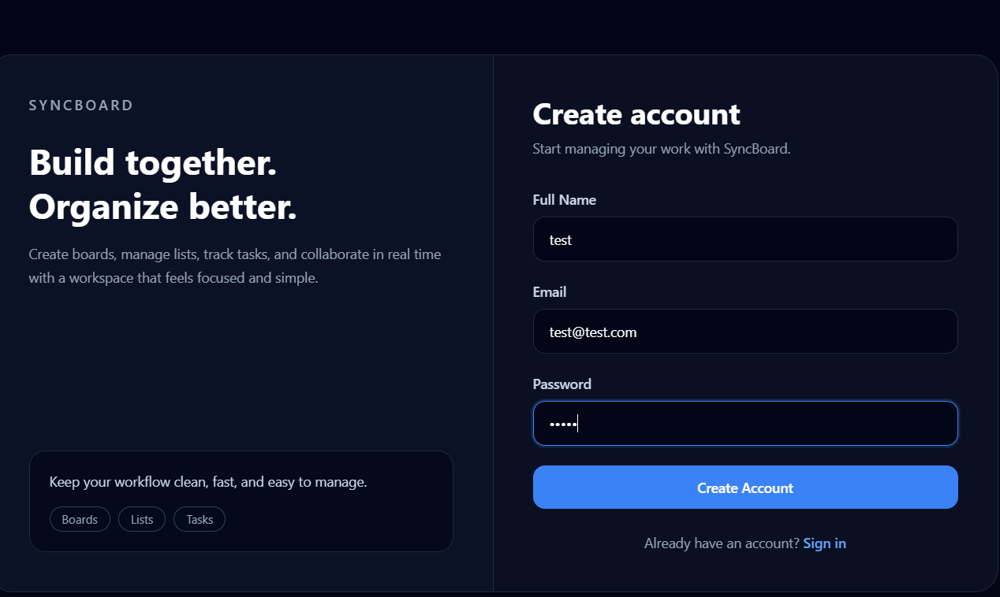
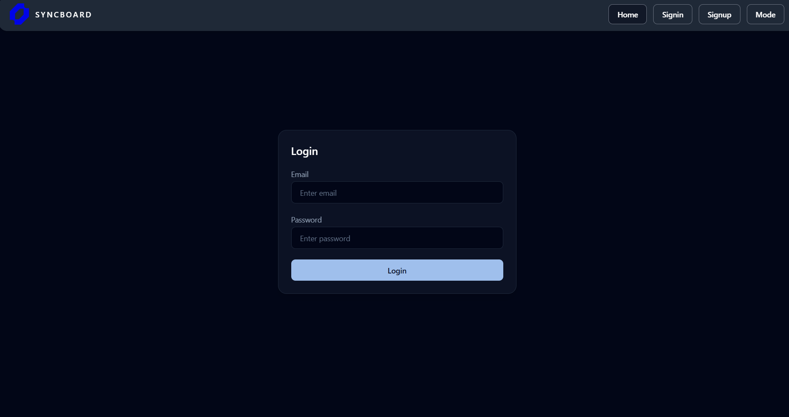
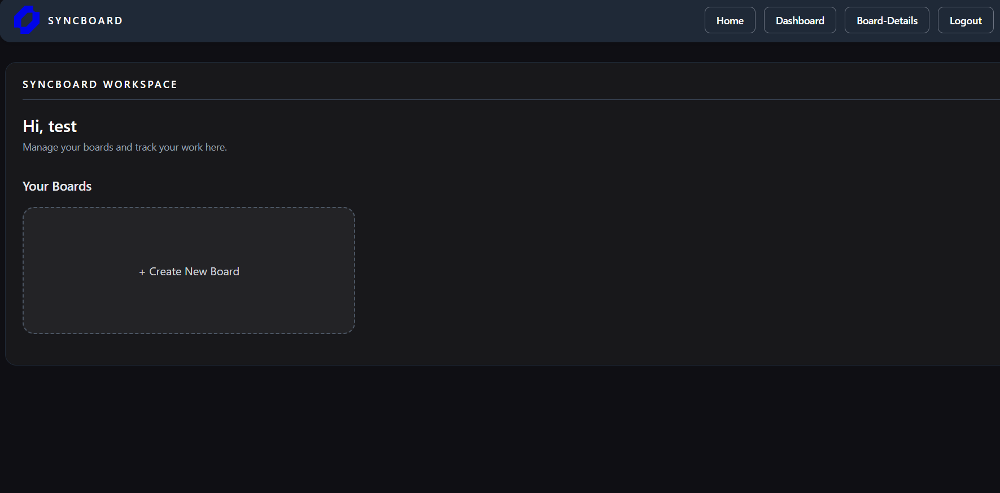
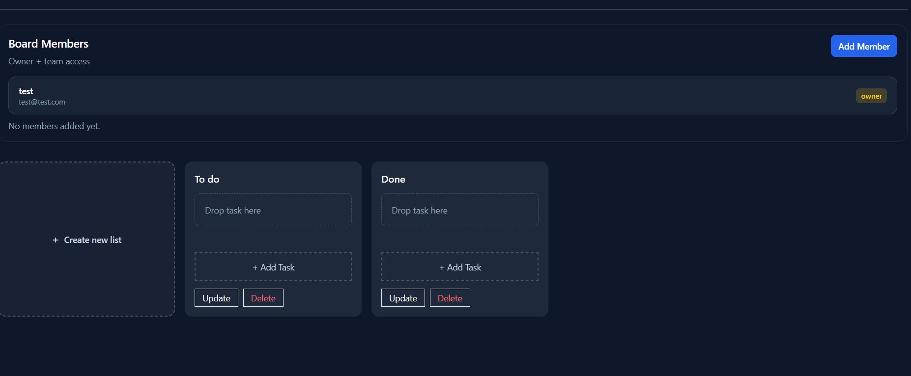
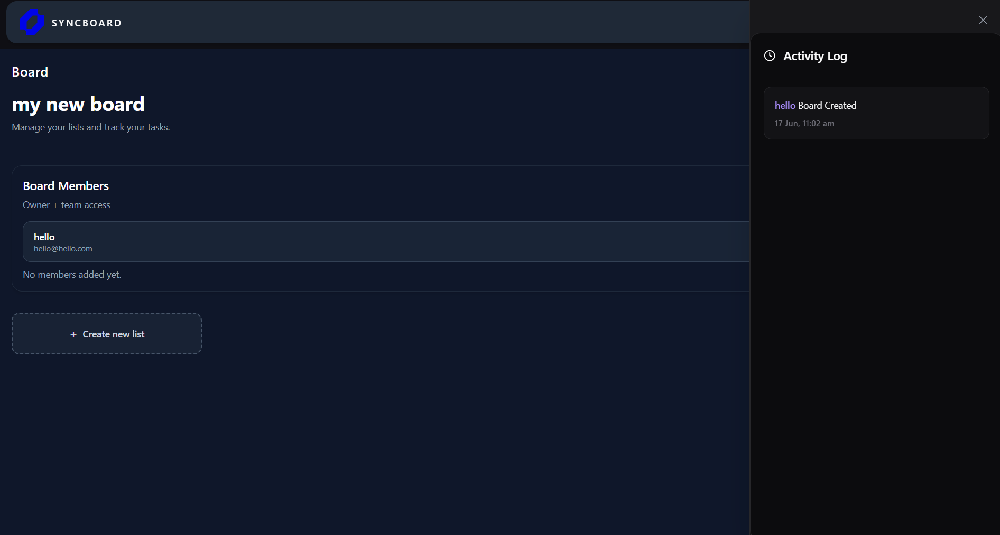
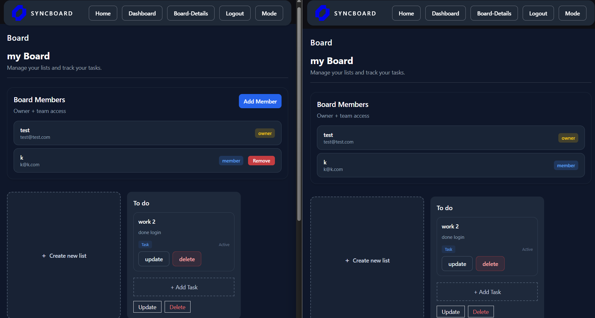

# 📋 SyncBoard — Real-Time Collaborative Project Management

[](https://nodejs.org/)
[](https://react.dev/)
[](https://www.mongodb.com/)
[](https://socket.io/)

SyncBoard is a real-time collaborative project management platform designed to help teams organize tasks, track project progress, and collaborate seamlessly. 

By eliminating delayed updates and poor visibility, SyncBoard enables multiple users to work on the exact same board simultaneously with instant interface synchronizations powered by **Socket.IO**.

---

## ⚡ Problem Statement & Impact

Traditional task management systems often cause communication gaps due to delayed page refreshes and siloed team activities. **SyncBoard** remedies this by injecting real-time state synchronization into standard agile board workflows. 

**The Impact:**
* **Enhanced Transparency:** Complete visual accountability over team operations.
* **Zero Lag Interaction:** Instantly updates cross-client viewports when workflow stages shift.
* **Traceable Micro-Journeys:** Every adjustment logs an immutable trail item for deep system auditing.

---

## ✨ Key Features

### 🔐 Authentication & Authorization
* Seamless secure user registration and portal access.
* Stateful verification using **JSON Web Tokens (JWT)**.
* Solid protected middleware route defenses coupled with Role-Based Access Control.

### 📊 Workspace & Board Management
* Create, inspect, modify, and drop dynamic team project environments.
* Integrated strict ownership control mechanisms.
* Collaborative invite structures to add/remove workspace members.

### 📑 Agile List Workflows
* Customize discrete structural workflow pipelines.
* Default template recommendations: `Backlog` ➡️ `To Do` ➡️ `In Progress` ➡️ `Review` ➡️ `Done`.

### 🃏 Smart Card Operations & Drag-and-Drop
* Microtask details containment (Create, Update, Delete cards).
* Smooth relative visual column rearrangement or vertical sequencing powered by `@dnd-kit`.

### 📡 Live Engine Sync (Socket.io)
* Instantly broadcast environment modifications (`cardMoved`, `createList`, `activityCreated`) across interconnected clients.

### 📜 Automated Audit Trail Tracking
* Centralized helper logic tracking updates in real time to generate persistent chronological history logs.

---

## 🛠️ Technology Stack

### Frontend
* **Core Core:** React (v18), React Router Dom (v6)
* **State Engine:** Redux Toolkit
* **HTTP Client:** Axios
* **Real-time Gateway:** Socket.IO Client
* **Visual Presentation:** Tailwind CSS
* **Interactions:** dnd-kit

### Backend & Database
* **Runtime Layer:** Node.js, Express.js
* **Database Engine:** MongoDB (ODM: Mongoose)
* **Real-time Server:** Socket.IO
* **Security & Crypto:** JWT (JSON Web Tokens), Bcrypt

---

## 📐 System Architecture

```text
       ┌────────────────────────┐
       │ Frontend (React/Redux) │
       └───────────┬────────────┘
                   │             ▲
          REST API │             │ WebSockets
          (Axios)  │             │ (Socket.IO)
                   ▼             ▼
       ┌────────────────────────┐
       │ Backend (Node/Express) │
       └───────────┬────────────┘
                   │
                   │ Mongoose ODM
                   ▼
         ┌──────────────────┐
         │     MongoDB      │
         │  (5 Collections) │
         └──────────────────┘
```

## System Architecture

Frontend (React + Redux)
        |
        | REST API
        |
Backend (Node.js + Express)
        |
      MongoDB

Socket.IO
    ↕
Real-Time Communication

---

## Project Structure

## 📁 Project Structure

```text
frontend/
├── src/
│   ├── components/
│   ├── pages/
│   ├── redux/
│   ├── services/
│   ├── Thunks/
│   └── utils/

backend/
├── controllers/
├── models/
├── routes/
├── middleware/
├── services/
├── socket/
└── config/
```

---

## 🔗 API Reference & REST Endpoints

### Authentication

```http
POST /api/v1/auth/register
POST /api/v1/auth/login
```

### Boards

```http
GET    /api/v1/boards
POST   /api/v1/boards
PUT    /api/v1/boards/:id
DELETE /api/v1/boards/:id
```

### Lists

```http
GET    /api/v1/lists/:boardId
POST   /api/v1/lists
PUT    /api/v1/lists/:id
DELETE /api/v1/lists/:id
```

### Cards

```http
GET    /api/v1/cards/:listId
POST   /api/v1/cards
PUT    /api/v1/cards/:id
DELETE /api/v1/cards/:id
```

### Activity Logs

```http
GET /api/v1/history/:boardId/activity
```

---

## ⚡ Real-Time Events

### Card Events

* `cardCreated`
* `cardUpdated`
* `cardDeleted`
* `cardMoved`

### List Events

* `createList`
* `updateList`
* `deleteList`

### Member Events

* `addMember`
* `removeMember`

### Activity Events

* `activityCreated`

---

## 🚀 Installation & Setup

### Clone Repository

```bash
git clone <repository-url>
cd syncboard
```

### Backend Setup

```bash
cd backend
npm install
```

Create a `.env` file:

```env
PORT=4000
MONGO_URI=your_mongodb_connection
JWT_SECRET=your_jwt_secret
CLIENT_URL=http://localhost:5173
```

Run Backend Server:

```bash
npm run dev
```

### Frontend Setup

```bash
cd frontend
npm install
```

Create a `.env` file:

```env
VITE_API_URL=http://localhost:4000/api/v1
```

Run Frontend:

```bash
npm run dev
```

---

## 📸 Screenshots

### Dashboard

*Add dashboard screenshot here*

### Board Workspace

*Add board screenshot here*

### Activity Log

*Add activity log screenshot here*

### Real-Time Collaboration

*Add multi-user collaboration screenshot here*

---

## 🚧 Challenges Faced

### Real-Time State Synchronization

Ensuring all connected users receive updates instantly while maintaining Redux state consistency.

### Activity Tracking

Designing a reusable history logging mechanism that records and synchronizes user actions in real time.

### Drag-and-Drop Reordering

Maintaining task order consistency across multiple clients while preserving visual accuracy.

### Access Control

Ensuring only authorized users can access and modify board data.

---

## 🔮 Future Enhancements

* Due Dates
* Notifications
* Search & Filtering
* File Attachments
* Board Templates
* Advanced Activity Analytics
* Email Invitations
* Mobile Responsive Enhancements

---

## 📈 Impact

SyncBoard improves team productivity by:

* Increasing transparency
* Reducing communication gaps
* Providing real-time visibility
* Maintaining a complete activity history
* Supporting collaborative project execution

---

## 👨‍💻 Developed By

**Harshita Bisht**

Built as a hackathon project focused on real-time collaborative project management using React, Redux Toolkit, Node.js, MongoDB, and Socket.IO.

## Demo Video

🎥 [Watch Demo Video](https://1drv.ms/v/c/8052bdfecffbe53c/IQBIrktDb54QT7Nx6jtJEvI7AZ4vRwN0lyP3dl230TrmzEc?e=hPFlFE)

## Live Link

🎥 [Live](https://sync-board-v1.vercel.app)

## Screenshots

###Home Page


### Register Page


### Login Page


### Dashboard


### Board View


### Activity Log


### Real Time Sync

